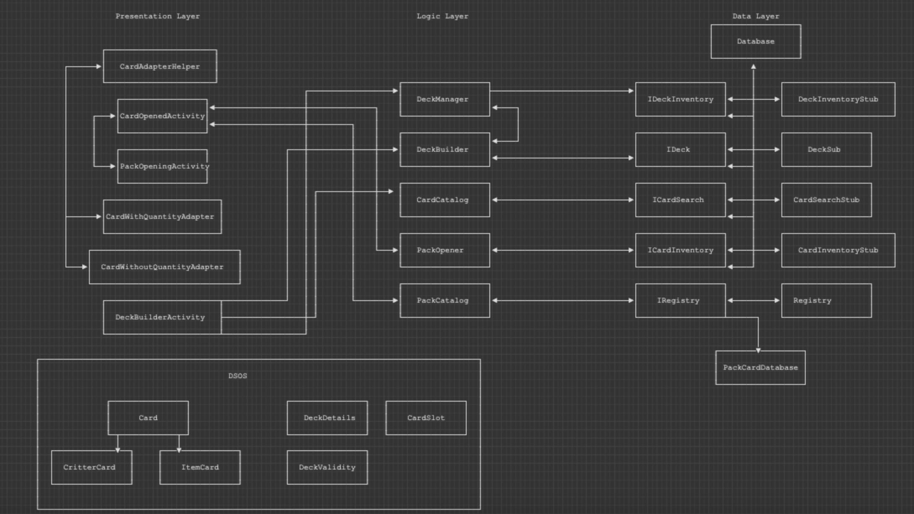
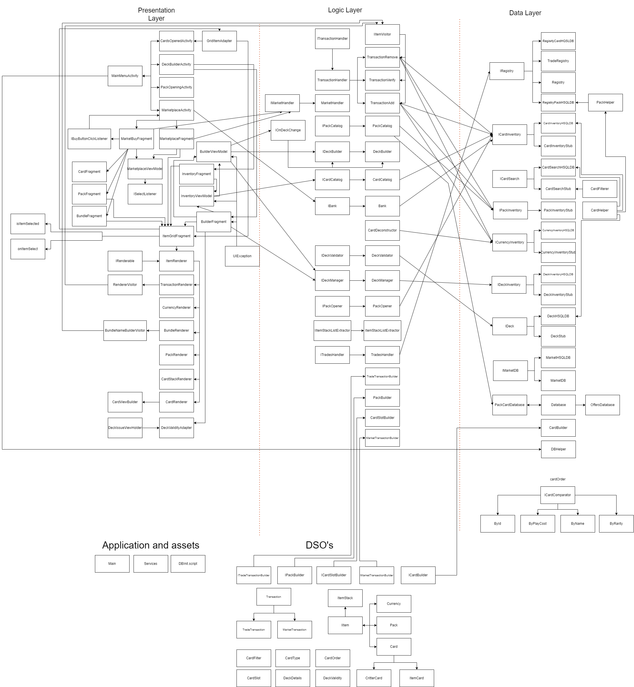

# Architecture (Iteration 1)

The first iteration follows a Three-Tier Architecture with the following packages:

## com.internetEnemies.combatCritters.objects

This package stores classes for any DSO's being passed between layers

### Card

Class containing the required attributes for a card.

### CritterCard

Child class of card. Adds required attributes needed for a Critter Card.

### ItemCard

Child class of card. Adds required attributes needed for an Item Card .

### DeckDetails

Class that passes information regarding decks that are stored within the database.

### Pack

Class that passed information regarding packs such as the list of cards available, and pull chances.

### CardSlot

Helper class for `Pack`. Stores the probabilites for pulling cards of a rarity.

### DeckValidity

Passes the validity of a deck between layers.

## com.internetEnemies.combatCritters.presentation

This package stores classes related to the presentation/UI layer of the application.

### CardAdapterHelper

Class for inflating the shared views of CardWithQuantityAdaper and CardWithoutQuantity.

### CardWithQuantityAdapter

Creates the view of all the cards in the inventory section of the Deck Builder screen..

### CardWithoutQuantityAdapter 

Creates the view for all the cards that are available in the Deck Builder

### DeckBuilderActivity

Builds the main screen with the Deck Builder and inventory. 

### PackOpeningActivity

Can choose three packs to open from this screen. The packs are passed to CardsOpenedActivity through an intent.

## com.internetEnemies.combatCritters.Logic

This package stores classes related to any complex logic the application uses.

### **PackOpener**
Handles logic regarding the opening of packs.

### **CardCatalog**
Fetches information from the Card Inventory stored in the database.

### **PackCatalog**
Fetches information regarding packs in the databse.

### **DeckBuilder**
Handles contents of individual Decks stored in the data layer.  

### **DeckManager**
Handles information regarding the decks stored in the data layer.

Stores an instance of `IDeckInventory` used for storing multiple decks.

## com.internetEnemies.combatCritters.data

### ICardInventory

The interface for accessing the card inventory in the database. Allows us to add, remove, and get all the cards currently in the inventory.

### ICardSearch

The interface for quering cards within the database (ie. List of cards owned and their quantities).

### IRegistry

The interface for accessing the registry of Packs and Cards in the game. 

### IDeck

The interface for accessing the card contents of a deck.

### IDeckInventory

The interface for accessing intentification details of a a deck in the database.

# Architecture (Iteration 2)

*Here are some notable additions to Iteration 2.*

## com.internetEnemies.combatCritters.objects

### ItemStack

ItemStack works as a wrapper class for any of our DSOs. They give a quantity to any stored object.

### IItem and IItemVisitor

These classes work together to specify certain behaviour towards different instances of objects.

### Currency

A class that stores an Integer used for operations on the CurrencyInventory.

### Transaction, MarketTransaction, TradeTransaction

These classes store the necessary items needed for a transaction. These can include ItemStacks containing items, Currency, etc.

## com.internetEnemies.combatCritters.data

### ICurrencyInventory

Stores the current balance of the player's currency. Allows for operations on the value stored.

### IPackInventory

Stores the packs that the user has in their inventory.

## com.internetEnemies.combatCritters.logic

### ITransactionAdd, TransactionRemove, TransactionVerify, TransactionHandler

These classes handle transactions. ITransactionAdd, TransactionRemove, TransactionVerify use the IItemVisitor interface to allow for different
database interface interactions based on the type of DSO stored in each ItemStack.

### IMarketHandler, ITradeHandler

These classes get instances of each specific Transaction from data.

### CardDeconstructor

Allows for cards to be converted into currency.

### All files tagged HSQLDB

All of the files that have HSQLDB at the end of their file name are our java files for the real database. 
These files implement the existing interfaces that were used for the stubs. 

### CardHelper, PackHelper

These are just helpers that create DSOs for the HSQLDB.

### ByName, ByPlayCost, ByRarity, ById, ICardComparator

These are just used to order cards.

### MarketplaceFragment, MarketBuyFragment

These are the notable UI layer changes for the new marketplace, almost all of the other files were just to cleanup the presentation layer. 

# Architecture (Iteration 3)

*Here are the notable changes for iteration 3*

## Objects

### CardState

This is used for the battles

## com.internetEnemies.combatCritters.data

*TODO: ADD HERE*

## com.internetEnemies.combatCritters.Logic

### TradesHandler, TradeUpHandler

Two of our new features were card trading and card trade ups, these are various ways of acquiring different cards and cleaning up your inventory. These files just deal with the logic side of those features. 

### MarketCycle

This is is the logic behind the rotating deals in the market so that they change up from time to time.

### Everything battle related

Holy S**t are there alot of files for the battles. Basically every logic layer file related to the battles is at the bottom portion of the architecture diagram. All of them have their purposes and do many different things, but in the end they all deal with the insanley complex battle system that we have created. 

## com.internetEnemies.combatCritters.presentation

### MarketplacePopupFragment, CardDeconstructorPopupFragment

A couple new popups just to make things nicer.

### Renderers

We have alot of files now in the directory with the name *Something*Renderer. These files are for generating different views for the interface.

### TradeUp

The Trade Up presentation files are related to the new feature for trading up cards to better cards. We have a trade up screen that displays your cards and then the bar to put your cards into that will give you a new car of a higher rarity for 5 cards of the lower rarity. 

### Trading

The trading presentation files are for the new feature of trading where you can trade a combination of currency and(/or) cards to acquire new cards or currency. This interface has a main screen with a bunch of different traders that display what you give them and what they give you. 

### Battles

Lots of new presentation files for the Battle feature. We have a battle home screen, a win screen, a loss screen and then the main battle screen for when you are facing an opponent. The main battle sreen uses so many different files to get the layout of the screen to function and flow smoothly. 

