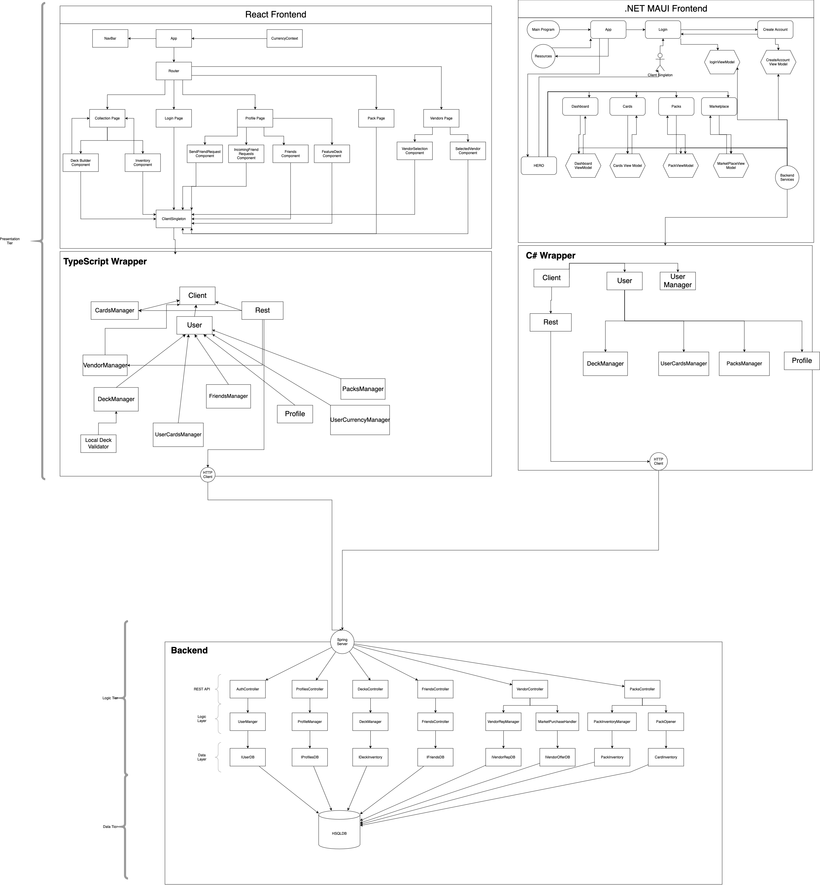

# Architecture

MAUI and React both provide good UI frameworks and can interface with a web api provided by spring. Since we are continuing a previous project and reusing some of the codebase, Java is required and spring boot seems like the commonly used library that will suit our requirements. Again since the codebase already exists, continuing with SQL makes sense and Postgres is free and open source. Using EC2(and S3/AWS overall) for hosting works well to meet our needs and it allows us to leverage other AWS services should the need arise.

# Sprint 1 High level Architecture

# Sprint 2 High Level Architecture 

