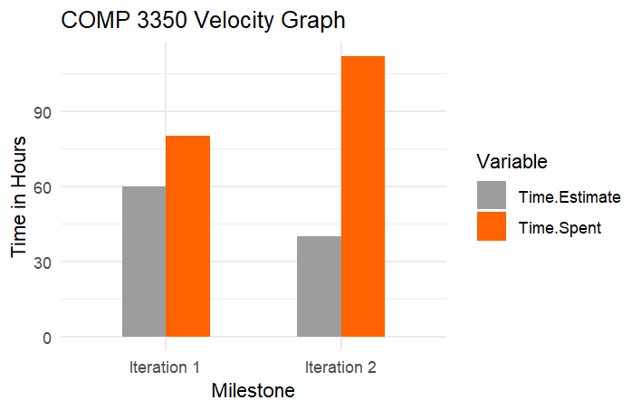

# RETROSPECTIVE

 An issue that has been a part of our project throughout both Iterations 1 and 2 was the mismanagement of time within our project due to inaccurately predicting the amount of time needed. This led to the amount of time spent to be wildly different from what was predicted initially when creating tasks. For Iteration 1, a majority of the time spent was figuring out and planning issues and tasks in the middle of having these tasks being implemented, which caused progress of certain tasks to be blocked, for example presentation components relying on logic layer components, etc. This caused many features to be incomplete due to time constraints and to be pushed back to the next iteration. We considered this to simply be due to lack of experience in project planning.

However, we had the direct opposite happen within Iteration 2 where iteration planning was done quickly, and in such a way as to where no one task would impede the progress of another. With this iteration however, we had severely underestimated the time needed to complete the tasks, which in turn caused them to be started much later, forcing a time crunch which again caused more features to be pushed back to Iteration 3.

Our plan this upcoming iteration is to break our user stories into small dev tasks and begin work on them from the get go. In our previous iterations we grinded through large tasks in a short period of time which caused us all a lot of burnout. This iteration we will hopefully try to have a slow but consistent progression, working through manageable dev tasks. This will not only prevent burnout but will hopefully aid us in writing better code as we will have more time to digest the code we’ve written. One way we could measure this is by comparing the frequency of commits at the beginning of the iteration with the frequency of commits at the end of the iteration. At the end of the iteration if these frequencies are relatively similar that will show that we followed our plan.

In our last iterations, most of our dev tasks had to depend on the progress of the other layers, like presentation layer components having to wait for logic layer components to be done to get going which is inefficient. To improve this, we can design the interfaces in each layer before actually developing. In this way, we can prudently design the responsibility of each component and reduce the possibility of reworking a component due to another layer’s requirements. This could also enable us to work concurrently and does not need to wait for the other layers' components. One way to measure this is by counting the residuals of time estimation and actual time spent. If the difference between time estimation and actual time spent is lower than the previous iterations, this could count as a success.

