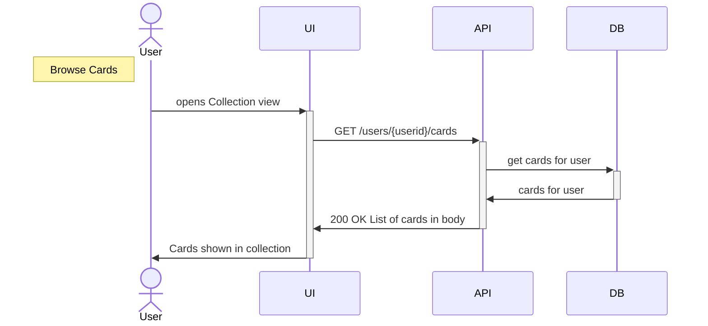

# Cards

```mermaid
sequenceDiagram
actor User
participant UI
participant API
participant DB

note left of User: Browse Cards
    User->>+UI: opens Collection view
    UI->>+API: GET /users/{userid}/cards
    API->>+DB: get cards for user
    DB->>-API: cards for user
    API->>-UI: 200 OK List of cards in body
    UI->>-User: Cards shown in collection
```