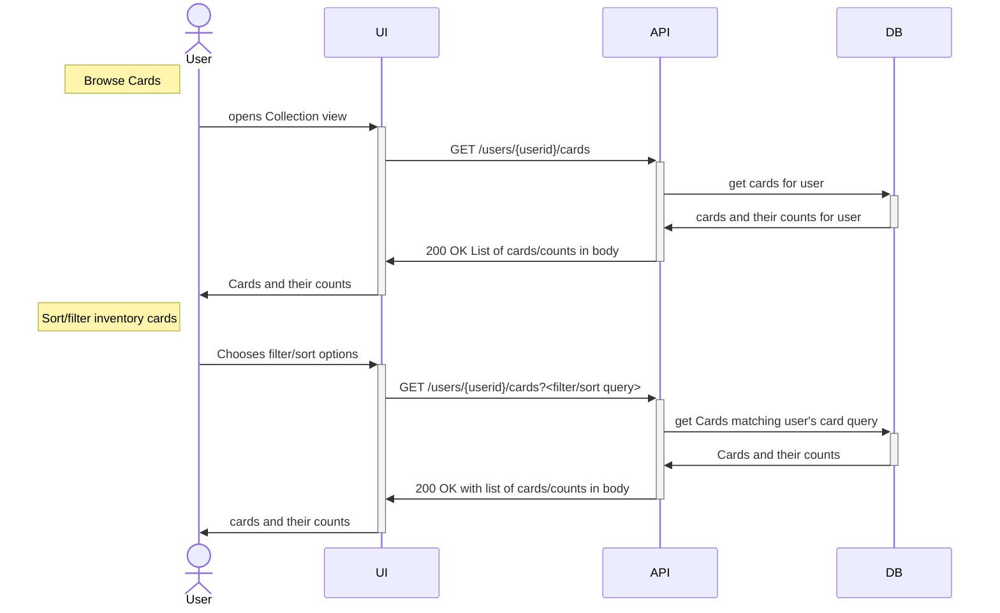

# Cards

```mermaid
sequenceDiagram
actor User
participant UI
participant API
participant DB

note left of User: Browse Cards
    User->>+UI: opens Collection view
    UI->>+API: GET /users/{userid}/cards
    API->>+DB: get cards for user
    DB->>-API: cards and their counts for user
    API->>-UI: 200 OK List of cards/counts in body
    UI->>-User: Cards and their counts 

note left of User: Sort/filter inventory cards
    User->>+UI: Chooses filter/sort options
    UI->>+API: GET /users/{userid}/cards?<filter/sort query>
    API->>+DB: get Cards matching user's card query
    DB->>-API: Cards and their counts
    API->>-UI: 200 OK with list of cards/counts in body
    UI->>-User: cards and their counts 
```