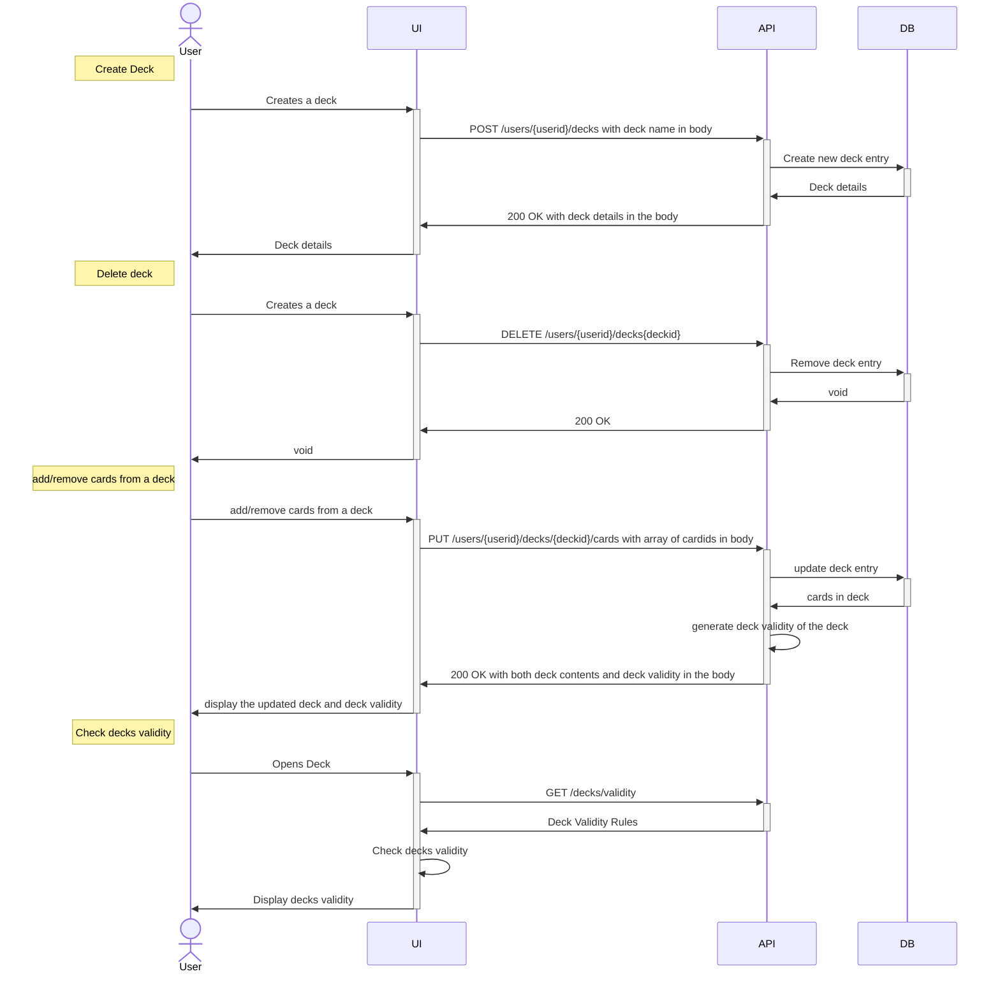

# Decks

```mermaid
sequenceDiagram
actor User
participant UI
participant API
participant DB

note left of User: Create Deck
    User->>+UI: Creates a deck
    UI->>+API: POST /users/{userid}/decks with deck name in body
    API->>+DB: Create new deck entry
    DB->>-API: Deck details
    API->>-UI: 200 OK with deck details in the body
    UI->>-User: Deck details

note left of User: Delete deck
    User->>+UI: Creates a deck
    UI->>+API: DELETE /users/{userid}/decks{deckid}
    API->>+DB: Remove deck entry
    DB->>-API: void
    API->>-UI: 200 OK
    UI->>-User: void

note left of User: add/remove cards from a deck
    User->>+UI: add/remove cards from a deck
    UI->>+API: PUT /users/{userid}/decks/{deckid}/cards with array of cardids in body
    API->>+DB: update deck entry
    DB->>-API: cards in deck
    API->>API: generate deck validity of the deck
    API->>-UI: 200 OK with both deck contents and deck validity in the body
    UI->>-User: display the updated deck and deck validity
        
note left of User: Check decks validity
    User->>+UI: Opens Deck
    UI->>+API: GET /decks/validity
    API->>-UI: Deck Validity Rules
    UI->>UI: Check decks validity
    UI->>-User: Display decks validity
```