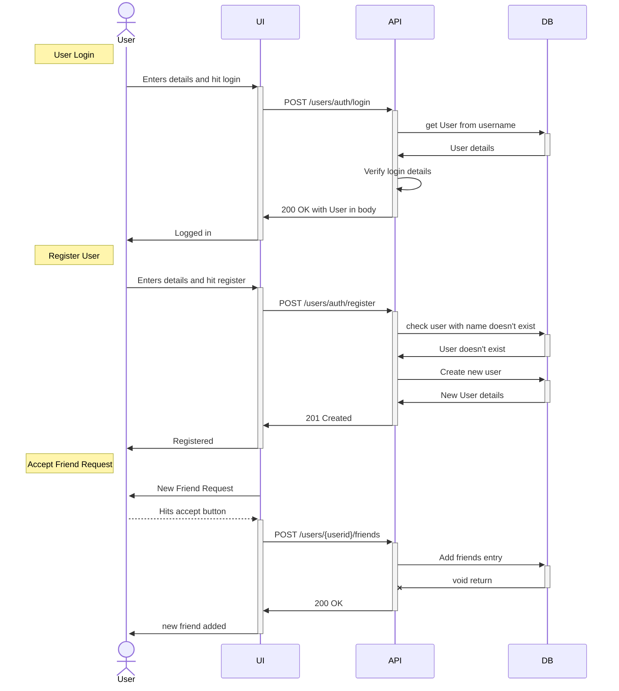
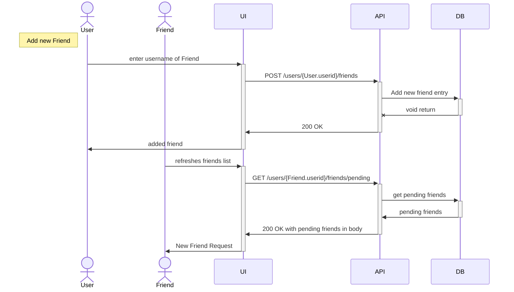

# User Profiles

```mermaid
sequenceDiagram
actor User
participant UI
participant API 
participant DB

note left of User: User Login
    User->>+UI: Enters details and hit login
    UI->>+API: POST /users/auth/login
    API->>+DB: get User from username
    DB->>-API: User details
    API->>API: Verify login details
    API->>-UI: 200 OK with User in body
    UI->>-User: Logged in

note left of User: Register User
    User->>+UI: Enters details and hit register
    UI->>+API: POST /users/auth/register
    API->>+DB: check user with name doesn't exist
    DB->>-API: User doesn't exist
    API->>+DB: Create new user
    DB->>-API: New User details
    API->>-UI: 201 Created
    UI->>-User: Registered
    
note left of User: Accept Friend Request
    UI->>+User: New Friend Request
    User-->>+UI: Hits accept button
    UI->>+API: POST /users/{userid}/friends
    API->>+DB: Add friends entry
    DB-x-API: void return
    API->>-UI: 200 OK
    UI->>-User: new friend added
```


```mermaid
sequenceDiagram
actor User
actor Friend
participant UI
participant API
participant DB

note left of User: Add new Friend
    User->>+UI: enter username of Friend
    UI->>+API: POST /users/{User.userid}/friends
    API->>+DB: Add new friend entry
    DB-x-API: void return
    API->>-UI: 200 OK
    UI->>-User: added friend
    Friend->>+UI: refreshes friends list
    UI->>+API: GET /users/{Friend.userid}/friends/pending
    API->>+DB: get pending friends
    DB->>-API: pending friends
    API->>-UI: 200 OK with pending friends in body
    UI->>-Friend: New Friend Request
```

```mermaid

```