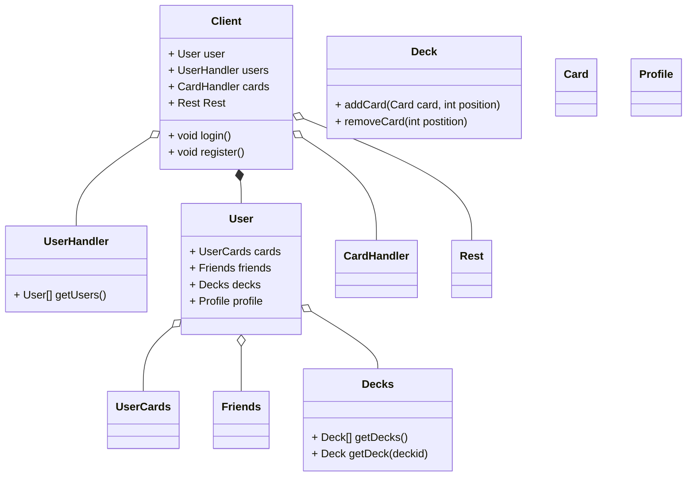

# Wrapper Spec
This file is a general specification for the C# and Typescript wrappers, 
this may not reflect exact method signatures. For proper documentation look 
at the wrapper specific repos.

*NOTE: the public class members are referring to JS getters and C# properties not actual public
class members*