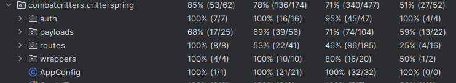

# Regression Testing
1. all unit tests are run on a PR or Commit into main, using Github actions
2. Test Reports:
    - [Test Run](https://github.com/InternetEnemies/CombatCritters/actions/runs/11672960914)
    - [Test Script](https://github.com/InternetEnemies/CombatCritters/blob/1354fa30098abb3c87d2f1b639851f74da94e37d/.github/workflows/gradle.yml)
        - this runs gradle build which runs gradle test, which runs all unit tests
# Testing Slowdown
We have kept all unit tests running on pull into main, but the integration tests are run manually as they take 5-20min to run. We have created two testing plans: testing plans for the backend and testing plans for the API wrappers.

# Not testing
- Frontend tier
    - ui layer
        - untested (Manual acceptance tests)
    - api wrapper layer
        - somewhat tested
- backend tier
    - presentation/api layer
        - mostly tested
    - logic layer
        - fully tested
    - data layer
        - tested indirectly through integration tests
- data tier
    - not tested

## API
*Column Legend: Class, Method, Line, Branch*
### Unit
*Logic/Data*  

*SpringBoot / Web API*  

The following are expansions on the packages which are somewhat lacking in coverage in the above image:

*Market*  

*Transaction*  

### Integration
*Spring / Web API*  

*Logic (The obscured package is 'Inventory')*  

*Transactions Package*  

## C# Wrapper

## Typescript wrapper
We were unable to get the coverage library to work for typescript.

# Profiler
The slowest endpoint is user creation, this is caused by initializing user cards. Currently, cards are added with a for loop, so we could probably improve this a fair bit by using a multi insert statement.

# Last Dash

We haven't fully finished all the features on the MAUI frontend (pack creation), so we will need to devote some of our time in sprint 3 to finishing that off.

In general, finishing battles and the flea market in less than a month seems like a pretty daunting task to all of us.

# Show Off

## Kevin

- [React card component](https://github.com/InternetEnemies/combatcritters-react/blob/baf6d82e1ffb4a2189fae9158423ae918efa362a/src/components/Card/index.tsx)
- This code is the card component that is used throughout the React application. I have chosen this as my best work because I am very happy with how the design of the card came out.

## Hugo

- [vendor object](https://github.com/InternetEnemies/combatcritters-ts/blame/main/src/objects/Vendor.ts)
- This code is the first time that I applied map function instead of a for loop, feels like a grown adult now
- Also used [filter](https://github.com/InternetEnemies/combatcritters-ts/blob/main/src/objects/DeckValidator.ts), yeah

## Eric
- [Transaction](https://github.com/InternetEnemies/CombatCritters/blob/0.1.7/app/src/main/java/com/internetEnemies/combatCritters/objects/Transaction.java)
- This code and its related interfaces allow for transactions of any type(for now that is just Vendor but soon, battles, and trades will also be handled) to be contained in a single class that can be processed by the TransactionHandler without any knowledge of the concrete transaction type.

## Somto
- [I'll just link the whole maui repo](https://github.com/InternetEnemies/combatcritters-maui)
- This was hard. Considering I knew nothing of csharp and xaml at the start. I would say, using MVVM, data bindings and figuring out how to connect the UI to models from the backend was a huge achievement for me. Thanks to Microsoft elite documentation of .NET MAUI.