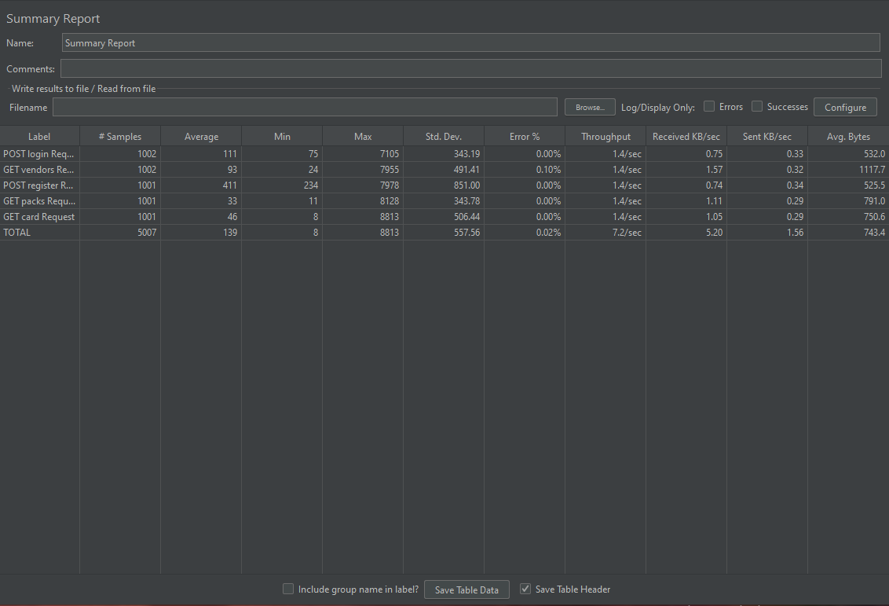
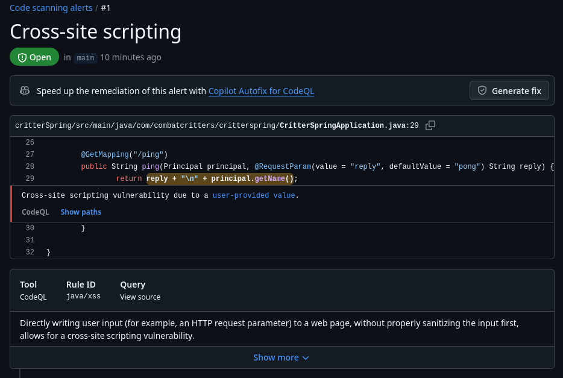
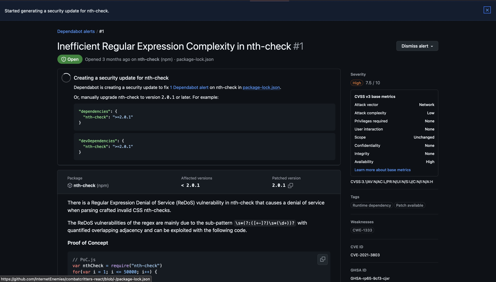

# Load Testing

1. Describe the environment for load testing, such as tool, load test cases.

We are using JMeter to load testing local host API backend. Test cases include login, get vendors, register user, get packs, get card. Running everything in one thread.

[jmx file](./CC_load_test.jmx)

2. Provide the test report for load testing.

3. Discuss one bottleneck found in the load testing.

Requests for user creation took a significantly longer time than other requests (~4x longer). This increase in time is due to having to write to the database (creating user properties, cards, etc.). This increase in response time isn't a huge issue though because registering would only make up a small percentage of the requests performed by our users.

4. Load testing should test the non-functional requirements - did you meet your goals? Why or why not? Could you meet your goals with money?

First off, we were unable to load test the non-functional requirements we set for ourselves back in sprint 0. The non-functional requirement we stated in the first worksheet was to be able handle 100 users battling concurrently. One of the main issues with this is that to enter a game a user first needs to have a valid deck. To achieve this we would need to have each test go through and buy cards from vendors and then create a deck with the cards they purchased, which just wasn't feasible in the time we had. 

Instead, our new non-functional requirement is to be able to handle 100 concurrent users accessing typical endpoints, which we successfully met. Load testing the expected typical user behaviour, we were able to handle ~200 concurrent requests per min with an average response time of 139ms. Spending money on better cloud services would certainly improve performance but it would not be necessary as our current performance is sufficient.

# Security Analysis

1. Describe the choice of the security analysis tool and how do you run it. The security analysis tool should analyze the language that is used in the majority of your source code.

The security analysis tool we use throughout our repos is GitHub's CodeQL. CodeQL performs a scan of the code on each PR into main.

2. Attach a report as an appendix below from static analysis tools by running the security analysis tool on your source code. Randomly select 5 detected problems and discuss what you see. Note that you are not required to fix the alarms (bugs and vulnerabilities) in the course.

The only problem CodeQL found was a XSS vulnerability in an undocumented route, this was fixed by removing the route. The route was a /ping route used for testing that was never removed and had a query param that would be returned as raw text, allowing JS injection. (eg `http://combatcriters.ca:4000/ping?reply=%3Cscript%3Ealert(%22hi%22)%3C/script%3E` would render as html/js)

This vulnerability was found by GitHub's Dependabot. After some research we discovered it is actually a [false alarm](https://stackoverflow.com/a/71333355) so we decided to just ignore it.

3. Handle (or mitigate) all Critical and High priority vulnerabilities in the project. Attach commits where these are handled. If no critical or high vulnerabilities, discuss 2 other problems found.

XSS vulnerability fixed here: https://github.com/InternetEnemies/CombatCritters/pull/263/commits/65ca108256bf22a3a68a9178a99082721a0d2212

# Continuous Integration and Deployment (CI/CD)

1. Describe your CI/CD environment and the clickable link to your CI/CD pipeline. For instance, if you use GitHub Action, provide the link to the workflow; if you use Jenkins, provide the link to the pipeline file.
    Our CI/CD are split between 2 files in each of the repos, CI is run on any PR into main and CD is run on release creation.
    - https://github.com/InternetEnemies/combatcritters-react/tree/main/.github/workflows
    - https://github.com/InternetEnemies/combatcritters-ts/tree/main/.github/workflows
    - https://github.com/InternetEnemies/combatcritters-sharp/tree/main/.github/workflows
    - https://github.com/InternetEnemies/combatcritters-maui/tree/main/.github/workflows
    - https://github.com/InternetEnemies/combatcritters/tree/main/.github/workflows
2. Snapshots of the CI/CD execution. Provide one for CI and one for CD to demo your have successfully set up the environment.
    - CI
        - https://github.com/InternetEnemies/combatcritters-react/actions/runs/12192446562
        - https://github.com/InternetEnemies/combatcritters-ts/actions/runs/12190536853
        - https://github.com/InternetEnemies/combatcritters-sharp/actions/runs/12124665600
        - https://github.com/InternetEnemies/combatcritters-maui/actions/runs/12191999470
        - https://github.com/InternetEnemies/CombatCritters/actions/runs/12200639208
    - CD
        - https://github.com/InternetEnemies/CombatCritters/actions/runs/12200655383
        - https://github.com/InternetEnemies/combatcritters-sharp/actions/runs/12124717952
        - https://github.com/InternetEnemies/combatcritters-maui/actions/runs/12192008607
        - https://github.com/InternetEnemies/combatcritters-ts/actions/runs/12190549065
        - https://github.com/InternetEnemies/combatcritters-react/actions/runs/12200698737

# Thoughts

What would you have changed about the design of your project, given you know what you know now?

1 paragraph - tell us about it. Discuss it with your grader.

One aspect of our project architecture that had both pros and cons was the separation of our project into five separate repositories. At the start of the project we thought that having the API wrappers and their respective frontends fully decoupled into separate repos would be a nice design strategy but it ended up making development in the front ends a real pain--this was because each time we wanted to add something to the API wrapper it needed to be published to npm or Nuget and then downloaded in the frontend. 

The one benefit of this though was that it allowed Eric to contribute to the C# wrapper. If the MAUI frontend and C# wrapper were not separated Eric would not have been able to build the project on his Linux machine.

# Other Thoughts 

What would you change about the project setup? Adding requirements? Removing/softening requirements? More check-ins? No check-ins? Something else?

Our group really messed up overcommitting to features and were penalized throughout the project for not completing everything we promised. While we understand that this is a real world lesson to not overcommit, we also feel that we delivered on some very sizable features and it would be nice if that was taken into account. With the way grading works now, it somewhat incentivizes committing only to the minimum viable product rather than trying to deliver something complex.
